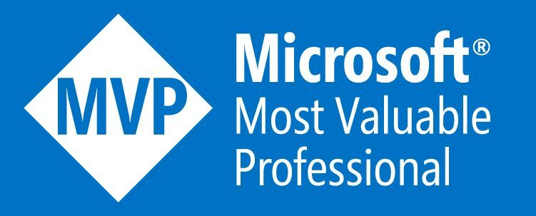

<h1 align="center">Hi there, I'm Mehdi Hadeli 👋</h1>

I'm a senior software engineer and technical lead, specializing in backend development and distributed systems. I have extensive experience in designing and implementing resilient, responsive, scalable, and maintainable systems using C#, .NET, Golang on top of cutting-edge technologies. My interests include microservices, system design, software architecture, domain driven design (DDD), event sourcing, CQRS, DevOps. I love learning, sharing, and facing challenges. I am an active open-source developer and working on numerous open source projects in the GitHub. 

Also, I’m honored to be recognized as a Microsoft MVP, an award from Microsoft that highlights my technical expertise and contributions to the .NET and open source community.

 
 
 
 
 
 

  

<h2 align="center">🛠 Technologies & Skils</h2>

    
    
    
    
    
    
    
    
    
    
    
    
    

 

<h2 align="center">💻 Open Source Projects</h2>

  I always make sure that I find enough time for open-source contributions that also help me expand my knowledge and work with other developers and teams globally. here are some of my projects:

- 💻 [mehdihadeli/AIAssist](https://github.com/mehdihadeli/AIAssist/): Context aware AI coding assistant inside terminal to help in code development, code explanation, code refactor and review, bug fix and chat with supporting local and online language models.
- 🍔 [mehdihadeli/food-delivery-microservices](https://github.com/mehdihadeli/food-delivery-microservices): A practical and imaginary food delivery microservices, built with .Net 8, MassTransit, Domain-Driven Design, CQRS, Vertical Slice Architecture, Event-Driven Architecture, and the latest technologies.
- 🍕 [mehdihadeli/go-food-delivery-microservices](https://github.com/mehdihadeli/go-food-delivery-microservices): A practical and imaginary food delivery microservices, built with golang, domain-driven design, cqrs, event sourcing, vertical slice architecture, event-driven architecture, and the latest technologies.
- 🎮 [mehdihadeli/game-leaderboard-microservices](https://github.com/mehdihadeli/game-leaderboard-microservices): Implementation of a imaginary Game Leader Board application, based on Event Driven Architecture, Vertical Slice Architecture, Event Sourcing with EventStoreDB, Redis SortedSet and Pub/Sub, SignalR and .Net 8.
- 📚 [mehdihadeli/awesome-software-architecture](https://github.com/mehdihadeli/awesome-software-architecture): A curated list of awesome articles, videos, and other resources to learn and practice software architecture, patterns, and principles.
- 📚 [mehdihadeli/awesome-dotnet-core-education](https://github.com/mehdihadeli/awesome-dotnet-core-education): A curated list of awesome articles and resources for learning and practicing .Net Core and its related technologies.
- 🍰 [mehdihadeli/vertical-slice-api-template](https://github.com/mehdihadeli/vertical-slice-api-template): An asp.net core template based on .Net 8, Vertical Slice Architecture, CQRS, Minimal APIs, API Versioning and Swagger.
- 🚃 [mehdihadeli/Go-MediatR](https://github.com/mehdihadeli/Go-MediatR): A library for handling mediator pattern and simplified CQRS pattern within an event driven architecture. inspired by csharp MediatR library.
- ☕ [mehdihadeli/spring-food-delivery-microservices](https://github.com/mehdihadeli/spring-food-delivery-microservices): A practical and imaginary food delivery microservices, built with java spring, domain-driven design, cqrs, vertical slice architecture, event-driven architecture, and the latest technologies.
- 📬 [mehdihadeli/java-mediator](https://github.com/mehdihadeli/java-mediator): A library for handling mediator patterns and simplified CQRS patterns within an event-driven architecture, inspired by csharp MediatR library.
- ⚡ [FastEndpoints/FastEndpoints - Contributor](https://github.com/FastEndpoints/FastEndpoints): A light-weight REST API development framework for ASP.Net 6 and newer.
- 📙 [davidfowl/TodoApi - Contributor](https://github.com/davidfowl/TodoApi): Todo application with ASP.NET Core Blazor WASM, Minimal APIs and Authentication.
- 🌭 [mehdihadeli/food-delivery-modular-monolith](https://github.com/mehdihadeli/food-delivery-modular-monolith): A practical and imaginary food delivery modular monolith, built with .Net 8, Domain-Driven Design, CQRS, Vertical Slice Architecture, Event-Driven Architecture, and the latest technologies.
- 🧪 [mehdihadeli/tdd-sample](https://github.com/mehdihadeli/tdd-sample): A sample project demonstrating Test-Driven Development (TDD) using .Net 8 and Vertical Slice Architecture based on Minimal APIs in .NET Core
- 💎 [mehdihadeli/go-vertical-slice-template](https://github.com/mehdihadeli/go-vertical-slice-template): A Golang boilerplate template, based on Vertical Slice Architecture and CQRS pattern with using Echo, Gorm, Zap, Viper, MediatR for CQRS and sarulabs/di for Dependency Injection.
- 🎬 [mehdihadeli/movie-search-application](https://github.com/mehdihadeli/movie-search-application): A simple movie search app, built with .Net 7, Vertical Slice Architecture and using TMDB APIs and YouTube APIs for searching and details of the movies.

<h2 align="center">🚀 Activities</h2>

  

